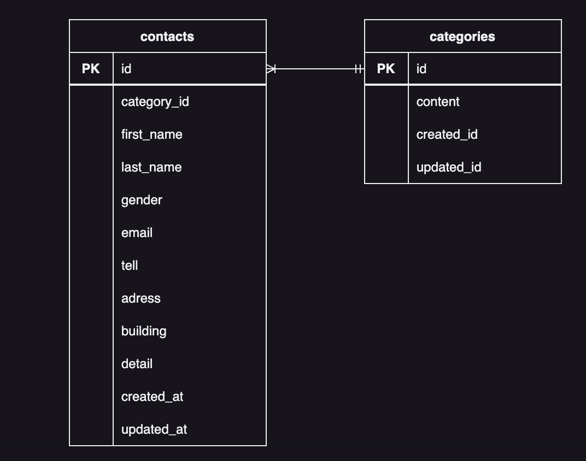

# お問い合わせフォーム

## 環境構築
### Dockerビルド 
1.git clone git@github.com:hikasahiroko/check-test.git 
2.docker-compose up -d --build 
＊MySQLは、OSによって起動しない場合があるのでそれぞれのPCに合わせてdocker-compose.ymlファイルを編集してください。 

### Laravel環境構築 
1.docker-compose exec php bsh 
2.composer install 
3..env.exampleファイルから.envを作成し環境変数を変更 
4.php artisan key:generate 
5.ptp artisan migrate 
6.ptp artisan db:seed 

## 使用技術(実行環境)
- PHP 7.3または8.0
- Laravel 8.0
- MySQL 8.0

## ER図

## URL
- 開発環境：http://localhost/
- phpMyAdmin：http://localhost:8080/